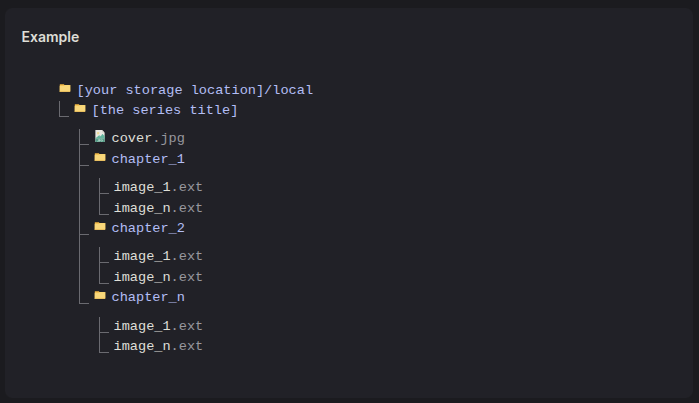
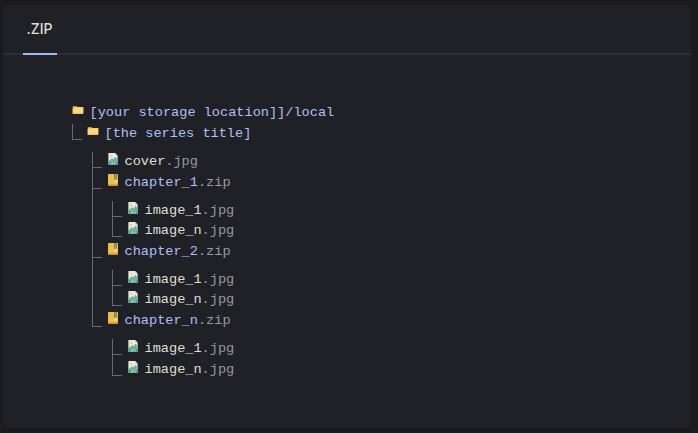

# `mi`hontool

## 說明

這是基於開源漫畫軟體 [`Mihon`](https://mihon.app/) 所建制的一個 `Linux` 終端執行的 `Shell` 腳本工具集，可以用於以下條件：
1. 需要排序的圖片資料夾及漫畫檔案夾。
2. 下載下來的漫畫資料夾檔案。
3. 統一任意格式成 `.webp`。
4. 依照 `Mihon` 文本說明裡的 [`Local Source`](https://mihon.app/docs/guides/local-source/#folder-structure) 建制資料夾架構。

## 注意事項

1. 重要：請勿用來做非法用途，不鼓勵任何侵犯著作權之行爲。
2. 提供 `Shell` 腳本及使用方式，歡迎你做任何的修正修改。

## 架構及邏輯

 

根據 [`Mihon`](https://mihon.app/) 文本說明中的 [Local Source](https://mihon.app/docs/guides/local-source/#folder-structure) 裡的架構圖，我最終修訂了一個不會因爲人爲亂擺調整資料夾檔案或是人爲干擾因素的標記系統腳本。

### 腳本邏輯

#### mastercontrol.sh
- 角色：總指揮。
- 功能：
    - 提供一個互動式選單，用於執行「完整流程」或「單一腳本」。
    - 檢查其他腳本是不是都在同一個資料夾內，若不在的話單獨執行該腳本會報錯。
    - 核心：在執行流程前，會自動清除 `errorlog.txt` 的歷史資料。
    - 除了選項1（`folderstate.sh`）之外，其他選項都會先依序執行 `markdown.sh` 和 `covercheck.sh`，確保所有資料夾都會先經過標記跟檢查。
    - 提供手動清除 `errlog.txt` 的功能。
    - 輸出的標記：`m0`、`m1`、`m2`、`m3`、`m4`、`mi`、`md`、`mf`。
      - 標記 `m3` 會進入下一步檢查。
      - 標記 `mf` 會寫入 `errorlog.txt` 提供檢查。

#### covercheck.sh（結構檢查系統）
- 角色：結構控管。
- 功能：
    - 只會檢查 `mi`、`md`、`m3` 標記的資料夾。
    - 條件：檢查 `cover.webp` 是否存在。如果不存在 -> 標記 `mf`。
    - 條件：檢查章節結構：
      - 是否有重複章節（例如 `chapter_2` 和 `chapter_2.cbz`） -> 標記 `mf`。
      - 章節是否不連續（例如只有 `chapter_1` 和 `chapter_3`） -> 標記 `mf`。
    - 狀態轉換：
      - 如果資料夾是 `m3` (混合) 且通過上述所有驗證，移除 `m3` 後標記 `mi`，將該資料夾變更爲 `packcbz.sh` 的封裝的對象之一。
      - 如果資料夾是 `mi` 或 `md` 且通過檢查，標記保持不變。

#### markdown.sh（標記系統）
- 角色：粗略標記者。
- 功能：
  - 執行前會移除所有除 `mf` 外的舊標記。
  - 會跳過已標記為 `mf` 的資料夾，也就是只增不減。
    - 條件：同時包含 `chapter_n` 資料夾和 `chapter_n.cbz` 檔案，標記 `m3`。
    - 條件：如果只包含 `chapter_n.cbz`，標記 `md`。
    - 條件：如果只包含 `chapter_n` 資料夾，且資料夾不為空，標記 `mi`。
    - 條件：如果上述皆非（平鋪資料夾），會根據指定其他條件標記 `m0`、`m1`、`m2`、`m4`。
  -  只有在「圖片數量大於 1 」 且沒有其他命名不正確的資料夾時，才會執行上述條件。
- 標記系統：
  - `m0`: `webp` 格式，未命名 `image_`。
  - `m1`: 非 `webp` 格式，未命名 `image_`。
  - `m2`: 非 `webp` 格式，已命名 `image_`。
  - `m4`: `webp` 格式，已命名 `image_`。
- 錯誤標記：如果上述所有條件都不滿足（例如：圖片數量=1，或 `mi` 結構的資料夾全空），則標記 `mf`。

#### autoconvert.sh（第一執行）
- 角色：將圖片轉換為 webp。
- 功能：
  - 處理 `m1` 和 `m2` 標記的資料夾。
  - 將 `jpg`, `png` 等格式轉換為 `webp`。
- 成功執行後：
  - `m1` 會變更爲 `m0`。
  - `m2` 會變更爲 `m4`。
- 任何檔案轉換失敗，標記 `mf`。

#### forcerename.sh（第二執行）
- 角色：標準化檔案命名。
- 功能：
  - 處理 `m0` 和 `m1` 標記的資料夾。
  - 將所有圖片命名為 `image_001.ext`、`image_002.ext`、`image_n.ext`... 排序。
- 成功執行後：
  - `m0` 會變更爲 `m4`。
  - `m1` 會變更爲 `m2`。
- 命名失敗的檔案，標記 `mf`。

#### actionmove.sh（第三執行）
- 角色：將漫畫資料夾內部轉換為 `chapter_1` 及 `cover.webp` 的結構。
- 功能：
  - 處理 `m4` 標記的資料夾（已轉檔、已標準化命名）。
  - 在漫畫主資料夾內建立 `chapter_1` 資料夾。
  - 複製 `image_001.webp` 到根目錄並改名為 `cover.webp`。
  - 移動所有 `image_*.webp` 檔案到 `chapter_1` 內。
- 成功執行後，`m4` 會變更爲 `mi`。
- 執行失敗會標記 `mf`。

#### packcbz.sh（第四執行或不一定要執行）
- 角色：封裝 `chapter_n` 資料夾。
- 功能：
  - 處理 `mi` 標記的資料夾。
  - 會尋找所有命名爲 `chapter_n` 資料夾（包含 `chapter_1`）。
  - 將每個 `chapter_n` 資料夾打包成 `chapter_n.cbz`，並刪除原資料夾。
- 成功執行後，`mi` 會變更爲 `md`。
- 執行失敗會標記 `mf`。

#### folderstate.sh
- 角色：狀態儀表板。
- 功能：
  - 掃描所有資料夾，統計 `m0` 到 `mf` 所有標記的數量。
  - 將結果輸出到 `folderstate.txt` 並顯示在終端機上。

## 腳本架構

|腳本(`.sh`)|主要功能|執行項目|
|--|--|--|
|`markdown`|重新命名及排序|`image_001.ext`, `image_002.ext`, `image_n.ext` 排序|
|`folderstate`|資料夾狀態統計|掃描標記及資料|
|`autoconvert`|轉換檔案格式|將任意圖片檔案轉換爲 `.webp` 格式|
|`forcerename`|重新命名及排序|`image_001.ext`, `image_002.ext`, `image_n.ext` 排序|
|`actionmove`|移動檔案及調整架構|將 `image_n.webp` 移入 `chapter_1` 及定義 `image_001.webp` 作爲 `cover.webp` 使用|
|`packcbz`|封裝 `chapter_n.cbz`|封裝完畢之後移除 `chapter_n` 資料夾|
|`covercheck`|檢查資料夾結構|檢查`markdown`檢查不出的標記|
|`mastercontrol`|控制台|統合執行流程|

```
---
執行漫畫批次處理主控台前置作業。
---
正在清除日誌檔案 errorlog.txt 內的歷史資料...
---
 ✅ 日誌清理完成。
---
正在檢查並設置所有功能的執行權限...
---
 ✅ 腳本 autoconvert.sh 權限已設置。
 ✅ 腳本 forcerename.sh 權限已設置。
 ✅ 腳本 actionmove.sh 權限已設置。
 ✅ 腳本 packcbz.sh 權限已設置。
 ✅ 腳本 folderstate.sh 權限已設置。
 ✅ 腳本 markdown.sh 權限已設置。
 ✅ 腳本 covercheck.sh 權限已設置。
---
首次啓動執行檢查結果會在下一次選擇項目時清除。
---

==================================================
  📚 漫畫批次處理主控台 (Master Control) v3.1
==================================================
1. 資料夾狀態
2. 資料夾標記及檢查
---
3. 完整結構主體調整流程：標記 -> 檢查 -> 轉檔 -> 命名 -> 結構
4. 完整結構主體封裝流程：標記 -> 檢查 -> 轉檔 -> 命名 -> 結構 -> 封裝
---
5. 執行 webp 轉換
6. 執行 標準化命名
7. 創建 `chapter_1` 主體結構
8. 執行 `chapter_1` 主體封裝
---
9. 主動清除日誌及暫存檔案
0. 關閉主控臺
---
💻 輸入數字 0-9 來選擇執行項目: 
```

## 使用方式及環境

### A、使用環境

我個人是使用 `Linux `mi`nt` 作爲開發環境去建制這個腳本集，其他 `Linux` 版本的使用方式因系統終端指令差異我就不提及了。

1. 將 `mihontool` 資料夾內部的 `8` 個 `shell` 腳本直接複製到你的漫畫資料夾主目錄。

2. 開啓終端機（`Terminal`），指向你的漫畫資料夾主目錄：

```bash
cd ~/[your_comic_folder]
```
3. 使用 `chmod` 指令來升級腳本權限，供 `shell` 腳本正常使用：
```bash
chmod +x mastercontrol.sh
```
4. 輸入下面的指令啓動 `shell` 腳本：
```bash
 ./mastercontrol.sh
```
5. 每次執行項目完畢之後，`Enter鍵`會清除已執行完畢的結果（`clear`）保持終端機乾淨。
6. 若子腳本沒有正常執行，請手動執行 `chmod` 指令。

## 建議及小提醒

1. 如果是在電腦上分類檔案及資料夾，推薦使用**完整結構主體調整流程**。
2. 如果是使用 [`Mihon`](https://mihon.app/) 的手機 `APP` ，不想**社死**請使用**完整結構主體封裝流程**。
3. 我是因爲澀澀因素使用 AI 做了這個分類轉換腳本集，不得不感嘆"人的動力始於澀澀"
4. 特別感謝 `Gemini` 的協助，讓我完成了這個腳本集，並且花了大約 7 天的時間除錯（`Flash v2.5`、`2.5 Pro`）。
